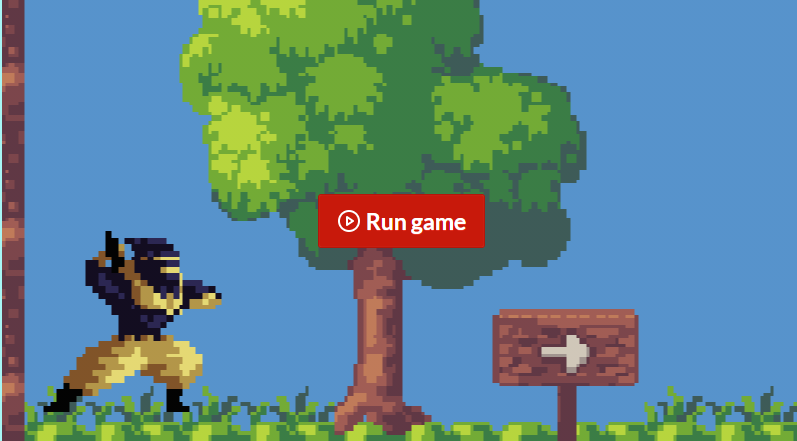
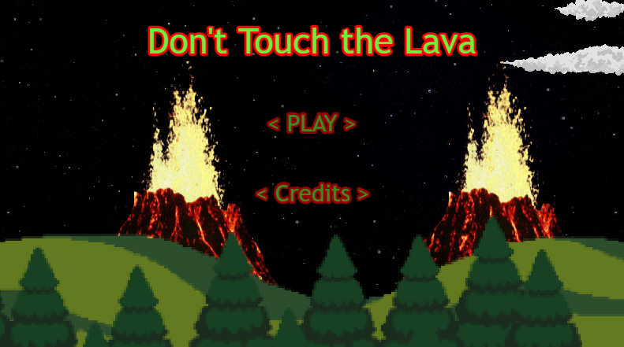
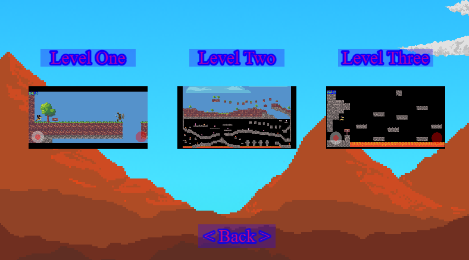
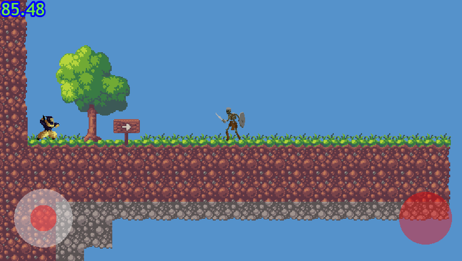
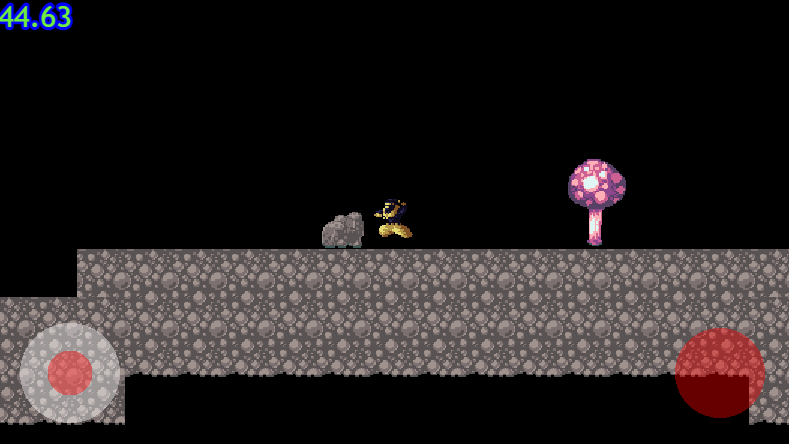
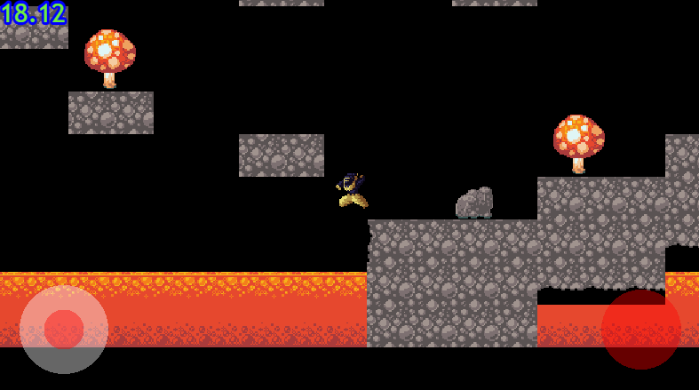
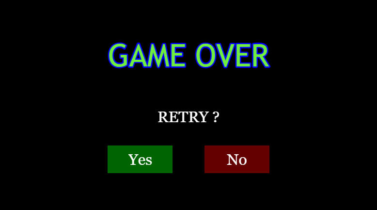

## Game 3 - Don't Touch the Lava

### Loic Konan

#### Click Below to play

<https://bdowling7.itch.io/side-scroller-beta>

#### Description

The goal of the game is for the player to get to the end of the map without being killed by one of the killer "B.O.B's" and not touch the lava. Currently there are three levels implemented.

### Files

|   #   | File                                     |
| :---: | ---------------------------------------- |
|   1   | [game.js](game.js)                       |
|   2   | [MainScene.js](MainScene.js)             |
|   3   | [Monsters.js](Monsters.js)               |
|   4   | [Phaser.js](Phaser.js)                   |
|   5   | [TitleScene.js](TitleScene.js)           |
|   6   | [data.js](data.js)                       |
|   7   | [jsconfig.json](jsconfig.json)           |
|   8   | [index.html](index.html)                 |
|   9   | [AI.js](AI.js)                           |
|  10   | [TitleScene.js](TitleScene.js)           |
|  11   | [VirtualJoystick.js](VirtualJoystick.js) |
|  12   | [firebaseConfig.js](firebaseConfig.js)   |
|  13   | [WinnerScene.js](WinnerScene.js)         |
|  14   | [ScoreScene.js](ScoreScene.js)           |
|  15   | [MS3.js](MS3.js)                         |
|  16   | [MS4.js](MS4.js)                         |
|  17   | [MS5.js](MS5.js)                         |
|  18   | [Controls.js](Controls.js)               |
|  19   | [BootScene.js](BootScene.js)             |
|  20   | [CreditScene.js](CreditScene.js)         |
|  21   | [GameOver.js](GameOver.js)               |

### Instructions

- Left Joystick to move.
- Right RED Joystick to jump really high.

### Monsters

     